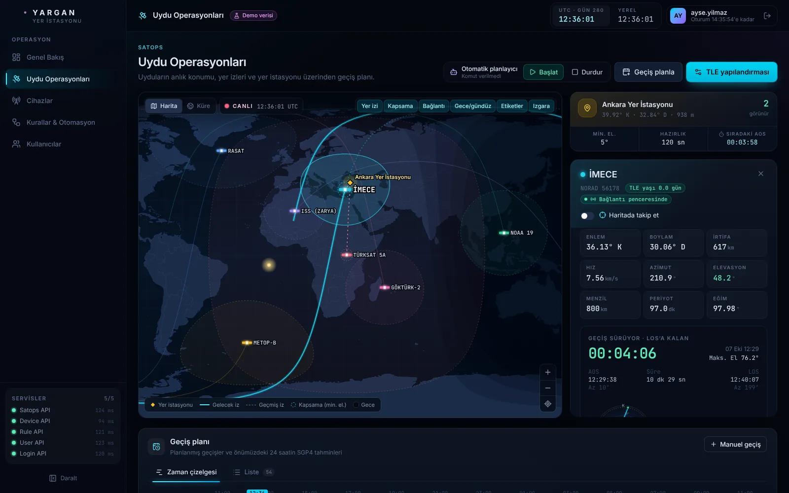
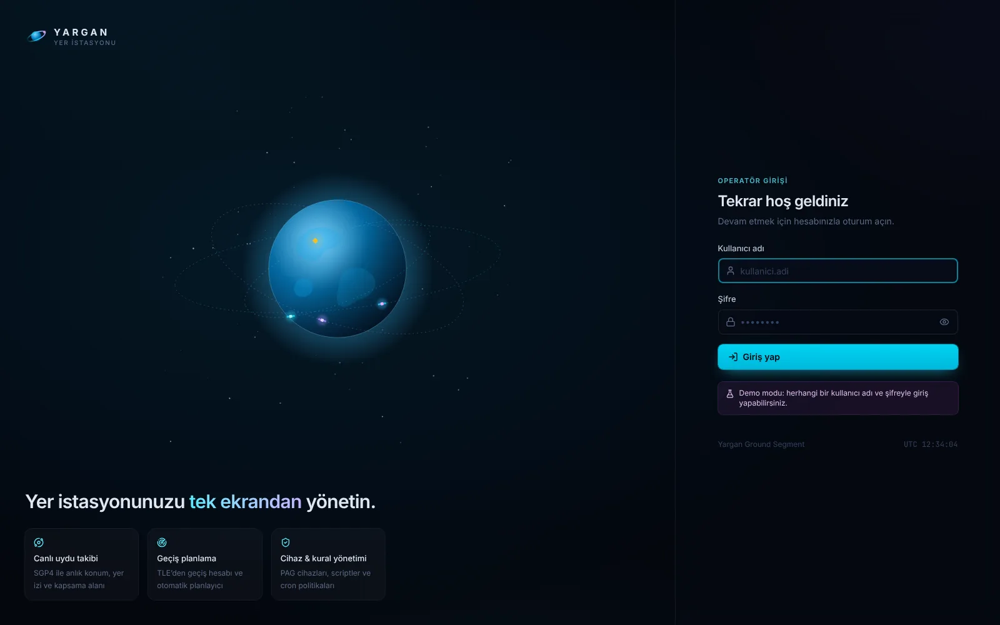
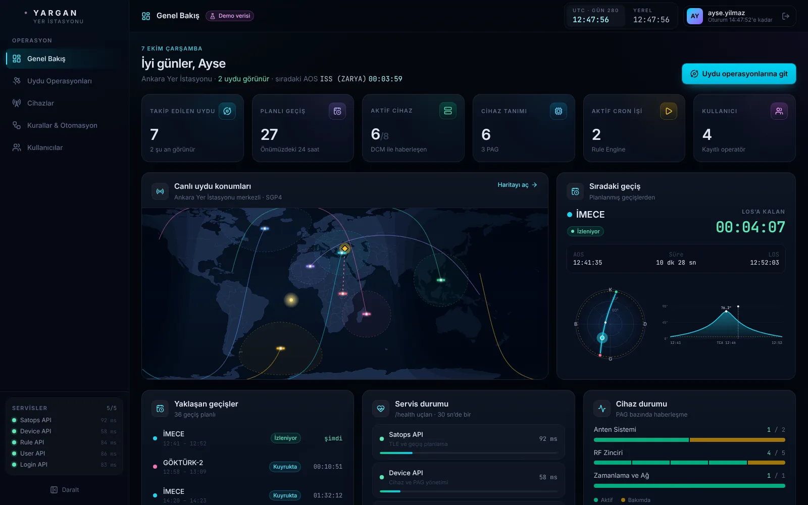
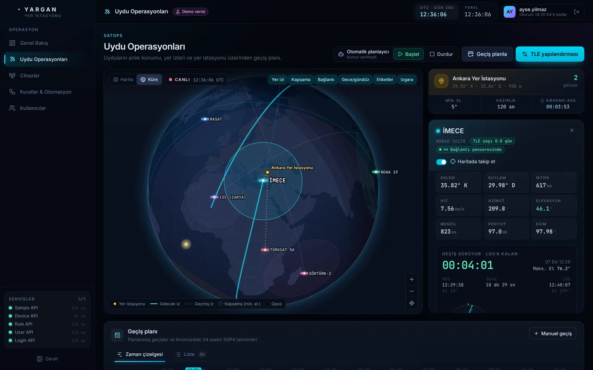
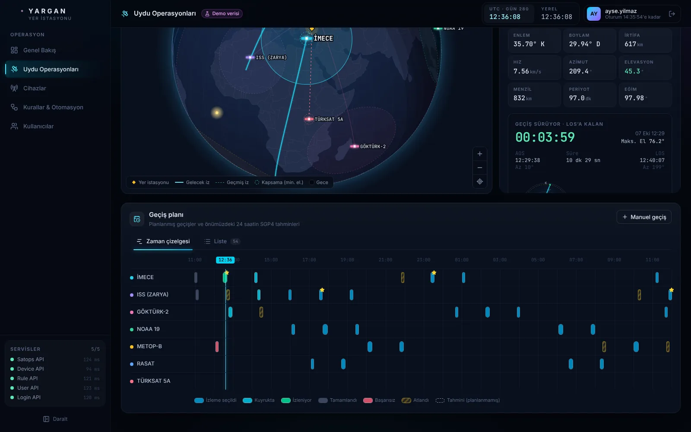
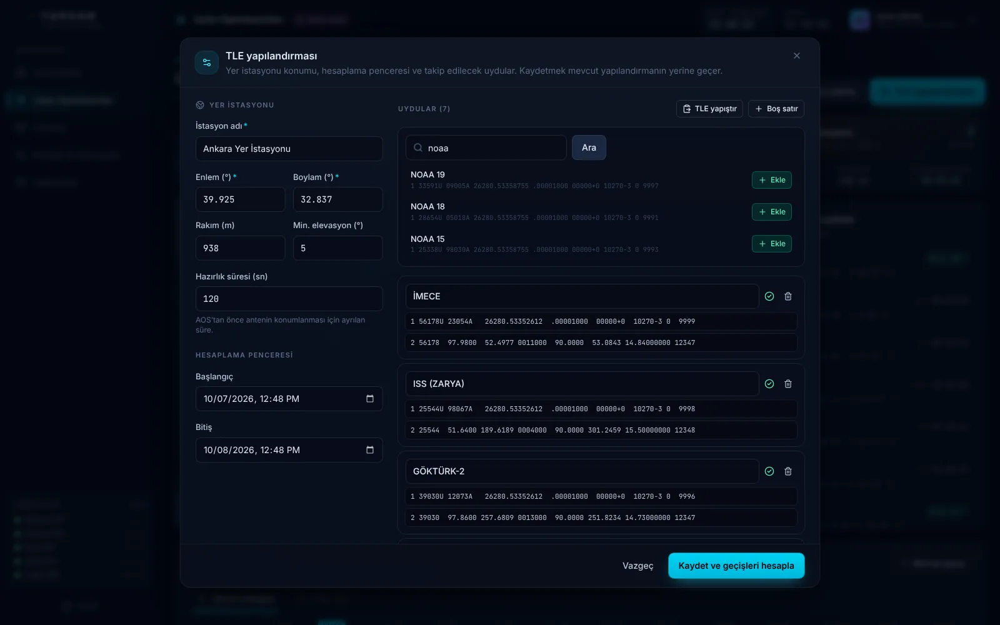
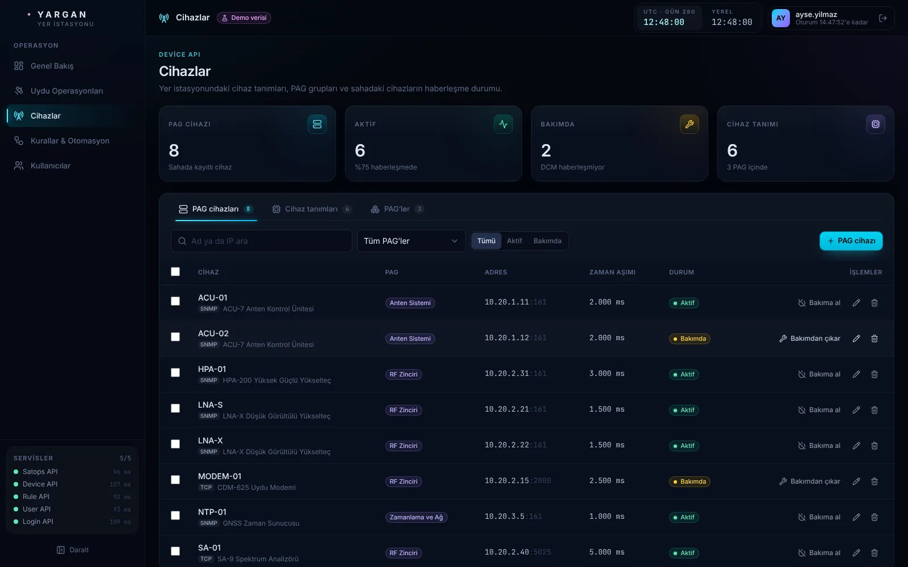
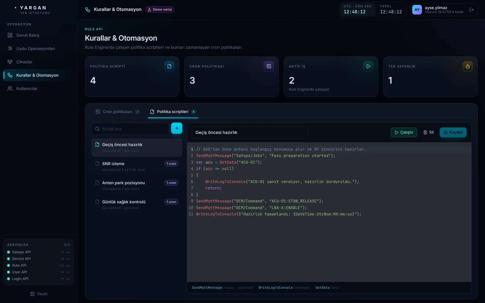

# Yargan UI

Yargan yer istasyonu için operatör arayüzü. Device, Rule, Satops, User ve Login API'lerini tek
ekranda toplar. Satops ekranında uyduların anlık konumunu SGP4 ile tarayıcıda hesaplayan canlı
bir dünya haritası bulunur.



## Özellikler

**Uydu operasyonları (Satops API)**
- Canlı harita: 2D eşdikdörtgen harita ya da sürüklenebilir 3D küre; uydular saniyede bir güncellenir.
- Yer izi, minimum elevasyona göre kapsama alanı, gece/gündüz sınırı, yer istasyonu–uydu bağlantı çizgisi, seçili uyduyu takip modu.
- Seçili uydu paneli: konum, irtifa, hız, azimut/elevasyon/menzil, periyot, eğim, TLE yaşı; sıradaki geçiş için geri sayım, gök haritası (polar) ve elevasyon profili.
- Geçiş planı: 24 saatlik zaman çizelgesi (Gantt) ve liste. Planlanmamış geçişler SGP4 tahmini olarak kesikli gösterilir.
- TLE yapılandırma sihirbazı: yer istasyonu konumu, hesaplama penceresi, uydu adıyla TLE arama, toplu TLE yapıştırma, satır/checksum doğrulaması. Hesaplanan geçişler seçilip planlamaya eklenir.
- Manuel geçiş ekleme ve otomatik planlayıcıyı başlatma/durdurma.

**Cihazlar (Device API):** PAG cihazları (bakıma alma/çıkarma, toplu işlem, filtreler), SNMP/TCP cihaz tanımları ve parametreleri, PAG'ler.

**Kurallar & otomasyon (Rule API):** cron politikaları (Türkçe zamanlama açıklaması, başlat/durdur), C# sözdizimi vurgulamalı politika scripti editörü (kaydet, bir kez çalıştır).

**Kullanıcılar (User API)** ve **Genel bakış:** KPI'lar, canlı mini harita, sıradaki geçiş, servis sağlığı (`/health`), PAG bazında cihaz durumu.

**Oturum (Login API):** JWT token'ı saklanır, tüm isteklere eklenir; 401 ya da token süresi dolunca giriş ekranına dönülür.

| | |
|---|---|
|  |  |
|  |  |
|  |  |
|  | |

Ekran görüntüleri demo modundan alınmıştır.

## Hızlı başlangıç

Node.js 20 ya da üstü gerekir.

```bash
npm install

# Backend olmadan, tarayıcı içi örnek verilerle (MSW):
npm run dev:mock

# Gerçek API'lere bağlanarak:
npm run dev
```

Arayüz http://localhost:5173 adresinde açılır. Demo modunda herhangi bir kullanıcı adı ve
şifreyle giriş yapılabilir. Demo modu açılışta taze sentetik TLE'ler üretir; uydu adları gerçek
olsa da yörüngeleri gerçek değildir.

### API adresleri

Geliştirme sunucusu istekleri `/svc/<servis>` önekiyle alır ve ilgili API'ye iletir. Varsayılan
hedefler YarganAPIService'teki `launchSettings.json` **http** profilleridir:

| Servis | Varsayılan | Ortam değişkeni |
|---|---|---|
| Device API | http://localhost:5098 | `DEVICE_API_URL` |
| Rule API | http://localhost:5165 | `RULE_API_URL` |
| Satops API | http://localhost:5131 | `SATOPS_API_URL` |
| User API | http://localhost:5050 | `USER_API_URL` |
| Login API | http://localhost:5002 | `LOGIN_API_URL` |

Farklı adresler için `.env.example` dosyasını `.env` olarak kopyalayıp düzenleyin. API'leri
`https` profiliyle çalıştırırsanız HTTP isteklerini HTTPS'e yönlendirirler (307); bu durumda
değişkenleri `https://localhost:<port>` olarak verin.

Tarayıcı tek origin gördüğü için API'lerde CORS ayarı gerekmez.

## Docker

```bash
docker build -t yargan-ui .
docker run -p 8080:80 --add-host=host.docker.internal:host-gateway yargan-ui
```

İmaj nginx ile statik dosyaları sunar ve `/svc/*` isteklerini API'lere iletir
(`nginx/default.conf.template`). Varsayılan hedefler `host.docker.internal` üzerindeki
http portlarıdır. docker-compose içinde servis adlarıyla değiştirin:

```yaml
yarganui:
  image: yargan-ui
  ports: ["8080:80"]
  environment:
    DEVICE_API_URL: http://deviceapi:8080
    RULE_API_URL: http://ruleapi:8080
    SATOPS_API_URL: http://satopsapi:8080
    USER_API_URL: http://userapi:8080
    LOGIN_API_URL: http://loginapi:8080
```

## Komutlar

| Komut | Açıklama |
|---|---|
| `npm run dev` | Geliştirme sunucusu (gerçek API'ler) |
| `npm run dev:mock` | Geliştirme sunucusu (demo verisi) |
| `npm run build` | Tip kontrolü + üretim build'i (`dist/`) |
| `npm run build:mock` | Demo modu açık üretim build'i |
| `npm run typecheck` | Yalnızca TypeScript kontrolü |
| `npm run lint` | oxlint |
| `npm run preview` | `dist/` çıktısını proxy ile önizleme |

## Backend ile uyum

Arayüz, Device API'deki çakışan rotaların ayrıştırıldığı sürümü bekler
(YarganAPIService, `claude/gifted-mendel-lhjckg` dalı, commit `c4574dd`). O commit'ten önce
`GET /api/Device` gibi uçlar `AmbiguousMatchException` ile 500 döner.

Arayüz gerçek backend'e karşı uçtan uca test edildi. Aşağıdaki davranışlar backend'den
kaynaklanır ve arayüzde görünür:

- `Repository.Delete` `SaveChanges` çağırmıyor: silme işlemleri başarılı döner ama kayıt silinmez.
- `SatellitePass/autostartorstop?status=true`, en az bir uygun geçiş varken `willBeSchedulePasses[i + 1]` yüzünden `ArgumentOutOfRangeException` (500) fırlatıyor.
- `SatellitePass/addpassesfromtle` mevcut geçişleri siliyor ve boş liste ekliyor. Arayüz geçiş eklemek için bu yüzden `SatellitePass/getpassbyrange` kullanır.
- `PagDevice/startorstop`, `isStart=true` ile cihazı bakıma alıyor (`InMaintenance = isStart`). Arayüz eylemleri etkisine göre "Bakıma al / Bakımdan çıkar" diye adlandırır.
- `PagDeviceResponse.InMaitenance` ve `SatellitePasses.IsImportent` yazım farkları yüzünden AutoMapper bu alanları eşlemiyor. Bakım durumu yanıtta gelmediği için arayüz bunu `PagDevice/getactive` listesinden çıkarır. Geçişlerin "önemli" bayrağı kaydedilmez.
- `UpdateUser` şifreyi hashlemeden yazıyor. Arayüz şifre alanı boşken mevcut hash'i geri gönderir; yeni şifre girilirse backend onu düz metin saklar ve kullanıcı giriş yapamaz.
- `UserResponse` şifre hash'ini döndürüyor (arayüzde gösterilmez).
- Geçiş zamanları sabit olarak Türkiye saatine çevrilip saat dilimi bilgisi olmadan saklanıyor. Arayüz bu tarihleri tarayıcının yerel saati olarak okur; sunucu ve tarayıcı farklı saat dilimindeyse geçişler kayar.
- Yer eşzamanlı uydular için backend aylarca süren tek bir "geçiş" üretebiliyor. Arayüz 12 saati aşan geçişleri "sürekli görünür" sayar.
- Alarm servisi için controller yok; arayüzde alarm ekranı bulunmuyor.
- Otomatik planlayıcının durumunu sorgulayan bir uç yok; arayüz bu tarayıcıdan verilen son komutu gösterir.

## Proje yapısı

```
src/
  api/            Servis istemcileri ve backend modellerinin tipleri
  auth/           JWT oturumu, korumalı rotalar
  components/     Arayüz kiti (ui/) ve iskelet (layout/)
  features/
    satops/       Harita, SGP4 hesapları, geçiş planı, TLE sihirbazı
    devices/      PAG cihazları, cihaz tanımları, PAG'ler
    rules/        Cron politikaları, script editörü
    users/        Kullanıcı formu
  pages/          Sayfalar (rota başına bir dosya)
  mocks/          Demo modu (MSW işleyicileri, örnek veri, sentetik TLE üretimi)
  lib/            Biçimlendirme, cron açıklaması, JWT, yardımcı hook'lar
nginx/            Üretim nginx şablonu
```

Teknolojiler: React 19, TypeScript, Vite, Tailwind CSS 4, TanStack Query, d3-geo + topojson
(world-atlas), satellite.js, CodeMirror, MSW.
